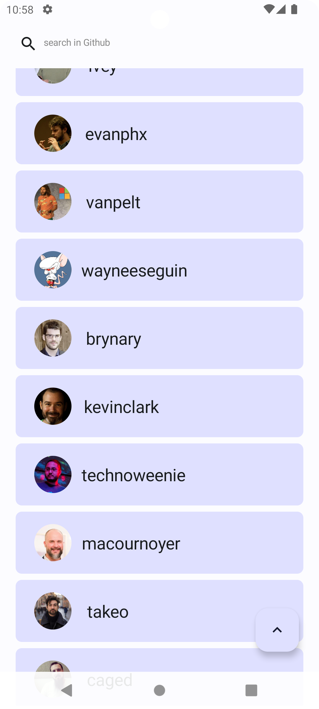
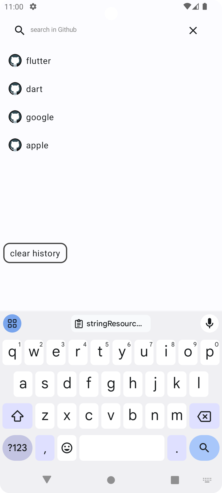
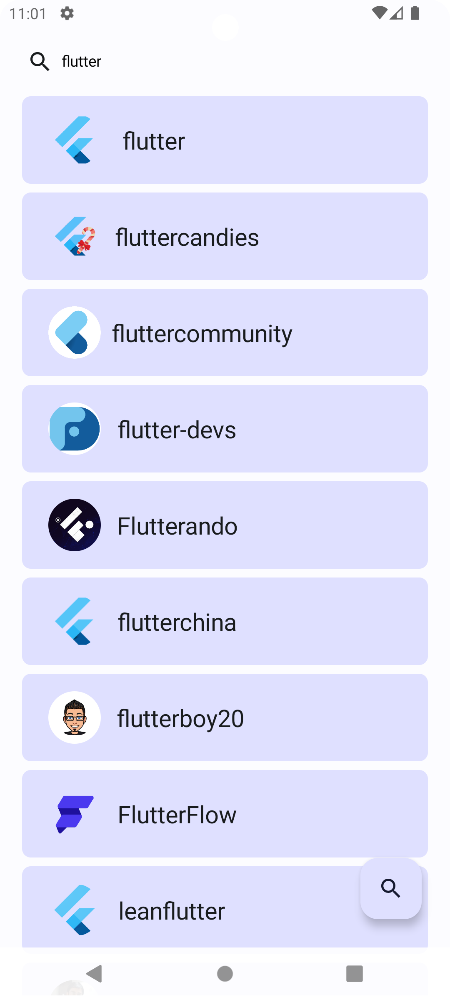
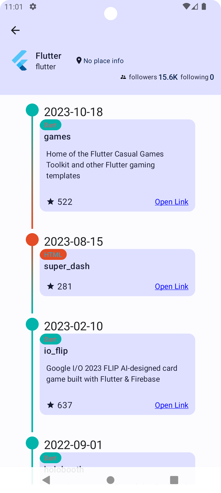
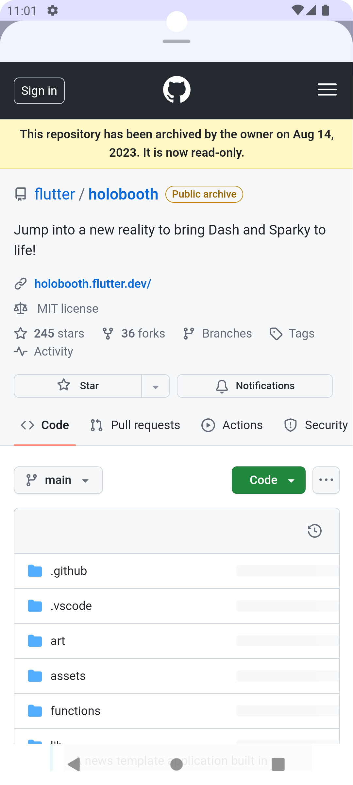

# Jetpack Compose Simple GitHub App

## Description

A simple GitHub client built using Jetpack Compose and follows the MVVM

- add api_key in local.properties then build

## Architecture

- MVVM

## Feature

- list user.
- search user.
- list user repositories without fork.
- save search history.

## Incomplete

- unit test.
- Refine the scrolling behavior of the LargeTopAppBar and LazyColumn in the user details page.
- Configure the GitHub Actions job to trigger when merging into the master branch.

## Third-Party Libraries

This project uses a number of third-party libraries:

### Google and Jetpack Compose

- Android Gradle Plugin (AGP): `8.4.0`
- Compose Compiler: `2023.08.00`
- Activity Compose: `1.9.0`
- Compose Material: `1.3.1`
- Compose WebView: `0.33.6`
- Navigation Compose: `2.7.7`
- Lifecycle Runtime KTX: `2.8.0`
- Core KTX: `1.13.1`
- Material Design: `1.6.7`
- Room Runtime: `2.6.1`

### Other Libraries

- Coil Compose for image loading: `2.6.0`
- Retrofit for networking: `2.9.0`
- Jackson for JSON parsing:
    - Converter Jackson: `2.11.0`
    - Jackson Annotations: `2.17.1`
- Logging Interceptor: `4.9.3`
- Testing libraries:
    - JUnit: `4.13.2`
    - JUnit Extensions for AndroidX: `1.1.5`
    - Espresso Core: `3.5.1`
    - Mockito Kotlin: `4.1.0`
    - Kotlinx Coroutines Test: `1.8.0`
    - Core Testing: `2.2.0`
- KSP (Kotlin Symbol Processing): `1.9.10-1.0.13`

## External Resources

- [Language Color Resource](https://github.com/github-linguist/linguist/blob/master/lib/linguist/languages.yml)

## Screenshots

|                               |                               |                               |
|:-----------------------------:|:-----------------------------:|:-----------------------------:|
|  |  |  |
|  |  |  |
|  |  |  |

## License

This project is licensed under the MIT License - see the [LICENSE](LICENSE) file for details.

### MIT License

