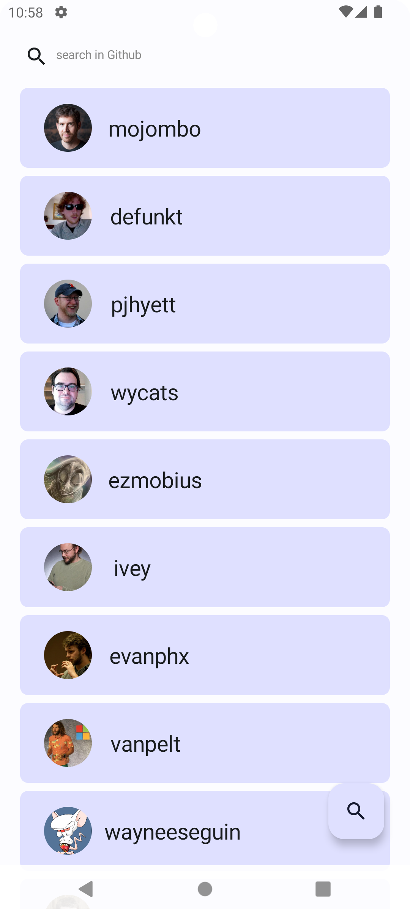
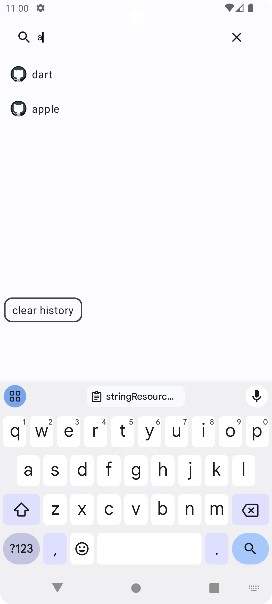
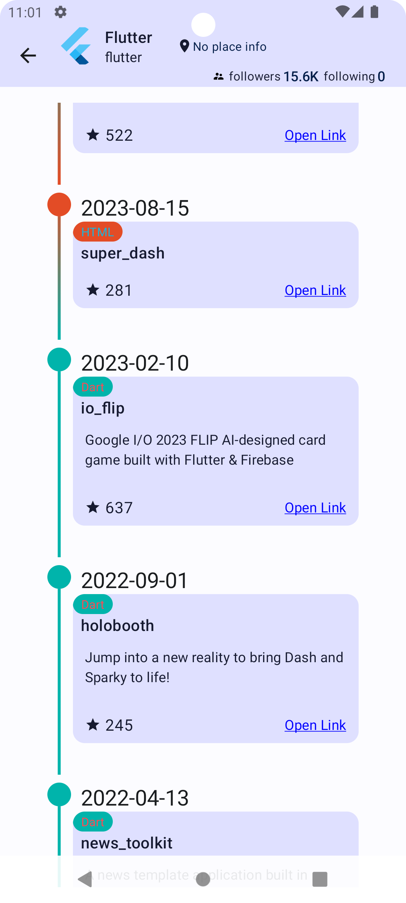
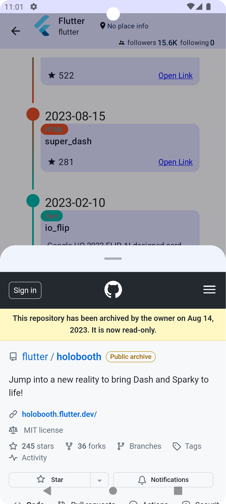

# Jetpack Compose Simple GitHub App

## Description

A simple GitHub client built using Jetpack Compose and follows the MVVM

- add api_key in local.properties then build

## Architecture

- MVVM

## Feature

- list user.
- search user.
- list user repositories without fork.
- save search history.

## Doing

- unit test.
- Refine the scrolling behavior of the LargeTopAppBar and LazyColumn in the user details page.
- Configure the GitHub Actions job to trigger when merging into the master branch.

## Library

HTTP: Retrofit.
Database: Room.
Image Processing: Coil.

## External Resources

- [Language Color Resource](https://github.com/github-linguist/linguist/blob/master/lib/linguist/languages.yml)

## Screenshots

|                               |                               |
|:-----------------------------:|:-----------------------------:|
|  |  |
|  |  |

## License

This project is licensed under the MIT License - see the [LICENSE](LICENSE) file for details.

### MIT License

